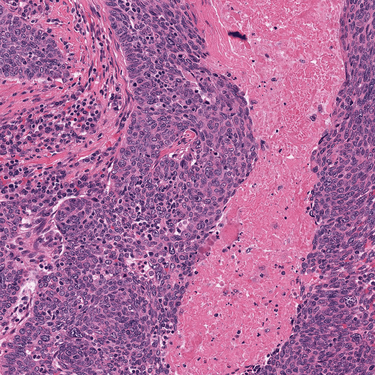

# WSI Counterfactual Steering

`wsi_cf` is a research codebase for whole-slide image counterfactual steering.
It links slide-level attention, SAE concept editing, PixCell region generation,
and downstream classifier evaluation into one reproducible workflow.



The default task is HNSCC HPV status. The showcase above edits a selected
`2048 x 2048` tissue region through overlapping PixCell windows: red marks the
current cells to edit, grey marks current context, and blue marks cells already
visited by the progressive editor.

## Workflow

The canonical workflow is:

1. visualize attention on whole-slide feature bags,
2. find useful `20x`-equivalent tissue regions,
3. select editable grid cells,
4. steer selected UNI features in SAE latent space,
5. generate the counterfactual region progressively with PixCell,
6. re-encode and evaluate edited regions downstream.

## Canonical Scripts

- `scripts/visualize_attention.py`: whole-slide attention heatmaps, CLAM-first.
- `scripts/find_regions.py`: region discovery by attention/pathology-aware scoring.
- `scripts/run_progressive_region_edit.py`: manifest-driven progressive region editing engine.
- `scripts/select_attention_cells.py`: attention-only cell selection and smoothing.
- `scripts/find_label_concepts.py`: label-relevant SAE concept discovery.

Core HPV examples live in `examples/hnscc_hpv/`:

```bash
bash examples/hnscc_hpv/01_visualize_attention.sh
bash examples/hnscc_hpv/02_find_regions.sh
bash examples/hnscc_hpv/03_run_showcase_edit.sh
bash examples/hnscc_hpv/04_run_region_eval.sh
```

The default HNSCC steering example is the current paper-style showcase:

```bash
PYTHON=/common/users/wq50/envs/pace/bin/python \
DEVICE=cuda:3 \
examples/hnscc_hpv_showcase_smoothed28/01_run_progressive_edit.sh
```

It uses `configs/edit_policies/showcase_best.json`, the smoothed-28 edit
manifest, and the legacy `relu_sae_base` checkpoint required by the existing
HNSCC prototype bundle. The containing folder also includes the matched naive
baseline and comparison metrics workflow. Under the canonical `center_2x2`
support constraint, the 28-cell historical request yields 14 coverable edited
cells across 5 progressive windows; the dropped border targets remain recorded
in the run manifest.

## Project Layout

- `src/wsi_cf/models/`: SAE, MIL, and CLAM model definitions maintained inside this repo.
- `src/wsi_cf/steering/`: SAE runtime/editing plus progressive edit planning.
- `src/wsi_cf/generation/`: PixCell/UNI helpers and diffusion windowing.
- `src/wsi_cf/data/`: slide, H5, region-bank, and proposal utilities.
- `src/wsi_cf/eval/`: task-specific classifier/evaluation helpers.
- `resources/`: versioned labels, manifests, model weights, prototypes, and task configs.
- `examples/hnscc_hpv/`: minimal runnable HPV workflow scripts.
- `examples/hnscc_hpv_showcase_smoothed28/`: end-to-end showcase tutorial.
- `docs/`: paper, method, testing, and migration notes.

Large raw slides and precomputed feature stores stay external. The repo stores only compact resources needed to reproduce the workflow configuration.

## Default Resources

- SAE checkpoint: `resources/models/sae/tcga_uni2_sae_relu_v1/relu_final.pt`
- SAE config: `resources/models/sae/tcga_uni2_sae_relu_v1/run_config.json`
- SAE variants: `tcga_uni2_sae_relu_v1` is the default; `relu_sae_base` is kept as a legacy
  switchback option through `--sae-variant relu_sae_base`.
- HNSCC HPV MIL checkpoint: `resources/models/classifiers/hnscc_hpv/mil_split0.pt`
- HNSCC HPV CLAM checkpoint: `resources/models/classifiers/hnscc_hpv/clam_split0.pt`
- HNSCC HPV prototypes: `resources/prototypes/hnscc_hpv/prototype_vectors_for_selected_sae.npz`
- Task registry: `resources/tasks/hnscc_hpv.json`

Note: the legacy HNSCC HPV prototype bundle records its own SAE provenance and was built
with the older `relu_sae_base` checkpoint. Regenerate that bundle before using legacy
prototype-file steering with the new default ReLU SAE. Concept-card steering builds
prototypes dynamically with the active SAE and is the preferred path.

## Quick Demo

```bash
PYTHON=/common/users/wq50/envs/pace/bin/python \
DEVICE=cuda:3 \
examples/hnscc_hpv_showcase_smoothed28/01_run_progressive_edit.sh
```

This is the default steering script for the repository. It runs the HNSCC
HPV-positive to HPV-negative showcase using `showcase_best` and writes debug
outputs under `artifacts/hnscc_hpv_showcase_smoothed28_tutorial/progressive/`.

For the full showcase comparison:

```bash
PYTHON=/common/users/wq50/envs/pace/bin/python \
DEVICE=cuda:3 \
examples/hnscc_hpv_showcase_smoothed28/run_all.sh
```

That tutorial produces classifier probabilities, progressive-stage trajectory
metrics, and RGB perturbation summaries for progressive editing versus the naive
baseline.
